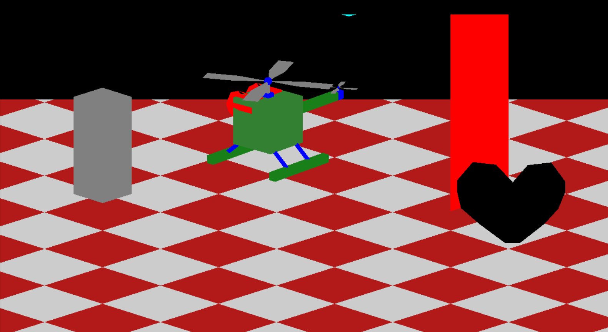
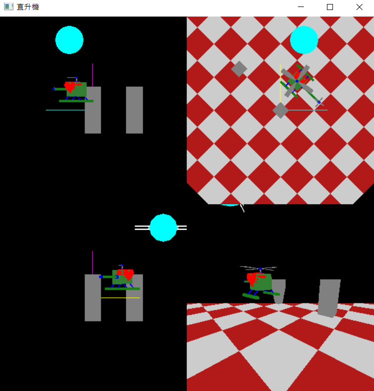
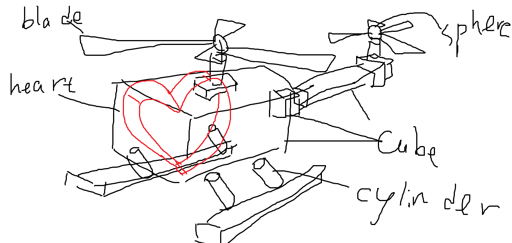

# Helicopter Simulator
 A helicopter model made with basic techniques of computer graphics.

## Implemented features:

### The helicopter could be able to:
* Move vertically. (up and down)
* Fly forward and backward.
* Make a turn.
* Rotate about the vertical axis.（Assume it is the y-axis.）
* Take-off and landing 
* Control the movements by using keyboard events

### Basic Scene:
* Some tall building (colorful cubes, cylinders, spheres) and a wide ground in the scene

### Viewing and Projection:
* Allow users to translate and rotate the camera position, focus, and view up vector (surge, heave, sway, roll, yaw, and pitchmotions.)
* 5 projection methods:
  * Method 1: Orthographical projection along x-axis
  * Method 2: Orthographical projection along y-axis
  * Method 3: Orthographical projection along z-axis
  * Method 4: Perspective projection
  * Method 5: Divide the window into 4 view-ports, 3 view-ports for displaying the orthographical projection images and 1 for viewing the perspective projection image

(Method5)

## How to execute "Helicopter.cpp"?

* You must import the following 4 header files:

  "iostream"、"stdio.h"、"math.h"、"GL/glut.h" (or "glut.h")

* And you have to make your project readable to "sky.bmp" 

  If this step fails, the following screen will appear: 
  
  

## How to play?:

### Control instructions: 
* 'w'/'a'/'s'/'d' go forward/backward/left/right 
* 'q' leave, 'p' pause 
* 'j'/'k' go up/down
* 'i'/'u' turn right/left
* 'o'/'l' left/right to fly
### Viewing Angle Switching: 
* '0'/'1'/'2'/'3'/'4' Display All (the other four) / Ortho X-axis / Ortho Y-axis / Ortho Z-axis / Perspective projection
* 'U'/'D' lens up/down, 'L'/'R' view left/right, 'I'/'O' view forward/back, 'P'/'H'/'r' pitching/heading/rolling
* ']' Displays the viewing angle range.
### Light and shadow switching: 
* '!' Switch light mode (sunlight/single-point movable light source (small golden ball)/helicopter flashlight)
* '@' Turn on/off all light sources, '#' switch the light color (R/G/B/normal light), 'space' move the small golden ball (circle)
* '$' Move the torch (down/a bit forward/forward), '[' show torch range, '+'/'-' increase/decrease light intensity
* '*'/'‘'/'’' increase/decrease specular index, 'c' switch emission light color (R/G/B/normal light), 'x' switch shadow mode (Smooth/Flat)
### Material/fog switch: 
* 'f' switch fog mode (0/1/2/3 no fog/LINER/EXP/EXP2), 'C' material screenshot.

## Draft of the helicopter:

Design according to the concept of local coordinate system (LCS)
